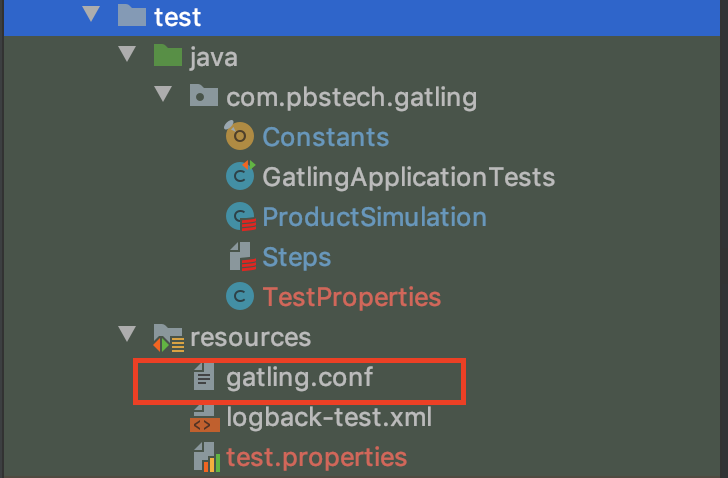
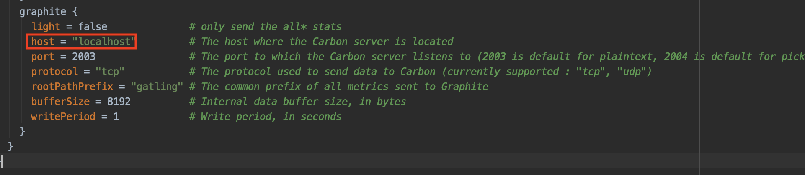
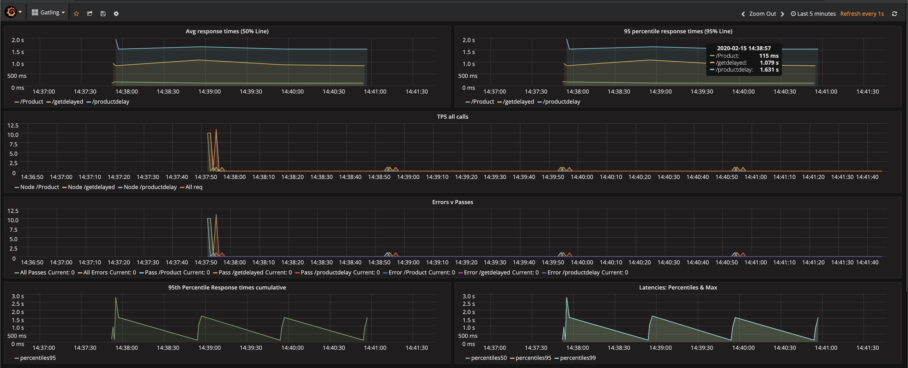

# Docker solution for Gatling using Influx and Grafana [Graphite enabled]

If you're a serious dev or performance engineer that leverages Gatling to run performance tests, this kit is an essential.

Its a light-weight docker-compose solution to spin up InfluxDB with Graphite enabled and Grafana for metrics collection and analysis during your Gatling test runs.

# Prerequisites
The solution needs docker and docker-compose

> Note: If you don't have docker or docker-compose, use the bash script below

> download the bash script from my repo

`sudo curl https://raw.githubusercontent.com/pbushan/GatlingInfluxGrafanaGraphite/master/grafana-influx.sh`

> run the bash script

`sh grafana-influx.sh`

> reboot your server

`sudo reboot`

# How to deploy if docker and docker-compose are already installed

Just clone this repo using 

`git clone https://github.com/pbushan/GatlingInfluxGrafanaGraphite.git`

Navigate in the folder 

`cd GatlingInfluxGrafanaGraphite`

Run docker-compose using

`sudo docker-compose up`

# Setting up Gatling to export metrics

If your gatling script doesnt have a `gatling.conf` file, create one in the test/resources folder

Look at a sample config file implementation at my demo repo https://github.com/pbushan/gatlingdemo/blob/master/src/test/resources/gatling.conf

Under the `graphite` section change the `host` name.

The next time you run your gatling test, your influxDb should be picking up Gatling metrics.

# Setting up your Grafana dashboard

Whats the point of all this effort if you can't view your metrics?
Thats why I've created a Grafana dashboard, so that you can focus on the important stuff.

1) Navigate to <your-grafana-hostname>:3000
2) The data source should be configured for you.
3) Click on `Grafana symbol` to your left top corner > Dashboards > Import
4) Upload the [gatling-grafana.json](gatling-grafana.json) file from this repo
5) Don't forget to save your dashboard

